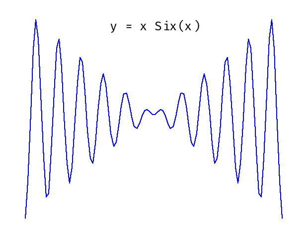

# zig-plot-lib

A simple plotting library in Zig that renders 2D plots and saves them as `.ppm` (P6) image files.
This library is underdevelopment.
This library currently allows you to:

- Draw points on a Cartesian coordinate system.
- Save the plotted image in raw binary PPM format.
- Time execution of drawing and saving steps.

---

## 🚀 Getting Started

### 📦 Build

Make sure you have [Zig](https://ziglang.org/download/) installed.
version : 0.14.0

```sh
zig build run --release=fast
# To view
feh plot.png
```

### Example program

```zig
const std = @import("std");
const lib = @import("zig_plot_lib");
const tf = @import("test_functions.zig");
pub fn main() !void {
    // Set Up allocator
    var da = std.heap.DebugAllocator(.{}){};
    defer _ = da.deinit();
    const allocator = da.allocator();

    const width = 620;
    const height = 480;
    const N = 100;
    var x: [N]f64 = undefined;
    var y: [N]f64 = undefined;
    const pi: f64 = std.math.pi;
    const factor = 2;
    const min_range: f64 = -factor * pi;
    const max_range: f64 = factor * pi;

    // Generate Points For plotting
    linspace(N, &x, min_range, max_range);

    var plot = try lib.LinePlot.init(allocator, null, width, height, .Dark);
    defer plot.deinit();

    try tf.sin(1, &x, &y);
    try plot.scatter(&x, &y, 2, lib.color.getColor(.green));
    try plot.plot(&x, &y, 1, lib.color.getColor(.red));

    try plot.save();
}

fn linspace(comptime N: usize, x: [*]f64, min: f64, max: f64) void {
    const dx = (max - min) / @as(f64, N - 1);
    for (0..N) |i| {
        x[i] = min + dx * @as(f64, @floatFromInt(i));
    }
}
```

Output Plot:


